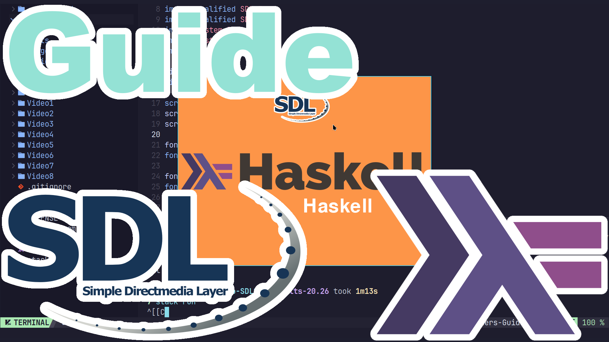

https://www.youtube.com/playlist?list=PLO02jwa2ZaiCej8ZpkhHKGN65v7pV1pMt
# Beginners Guide to SDL2 in Haskell
An in-depth guide to getting started with SDL2 in Haskell.

## Build and Run
You will need to make sure stack is installed.

ArchLinux instructions.
```
sudo pacman -S --needed stack
cd
git clone https://github.com/ProgrammingRainbow/Beginners-Guide-to-SDL2-in-Haskell
cd Beginners-Guide-to-SDL2-in-Haskell
stack run
```
## Controls
Up, Down, Left, Right - Moves the Logo.\
A, S, W, D - Moves the Logo.\
Space - Changes background color.\
Escape - Quits the game.
